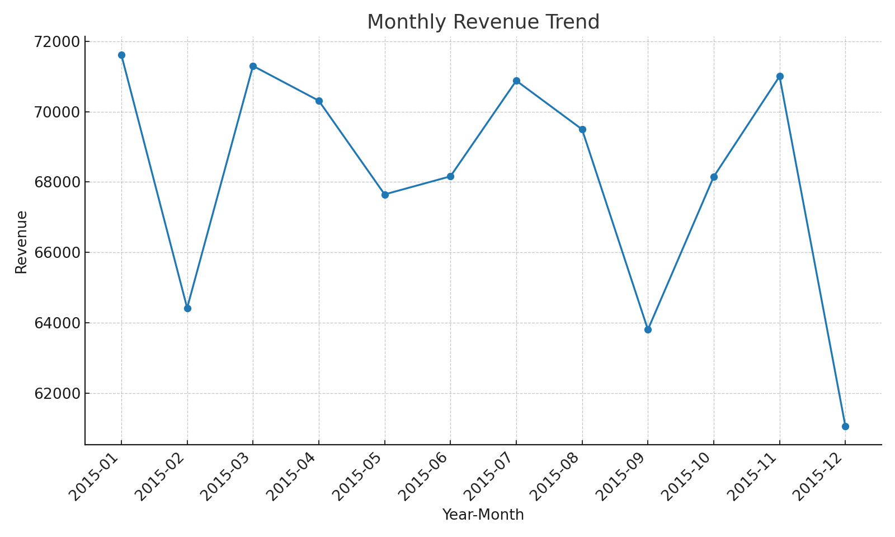
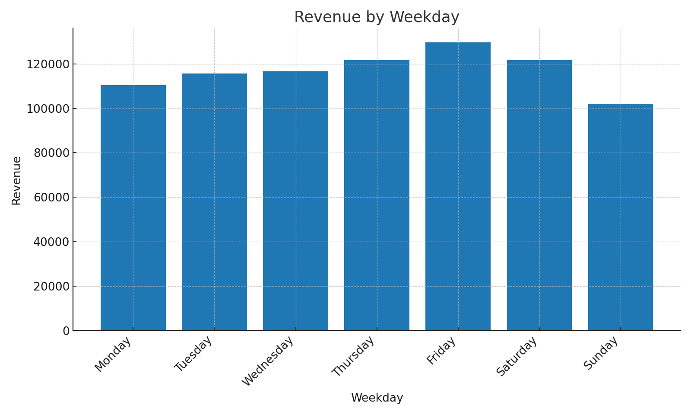
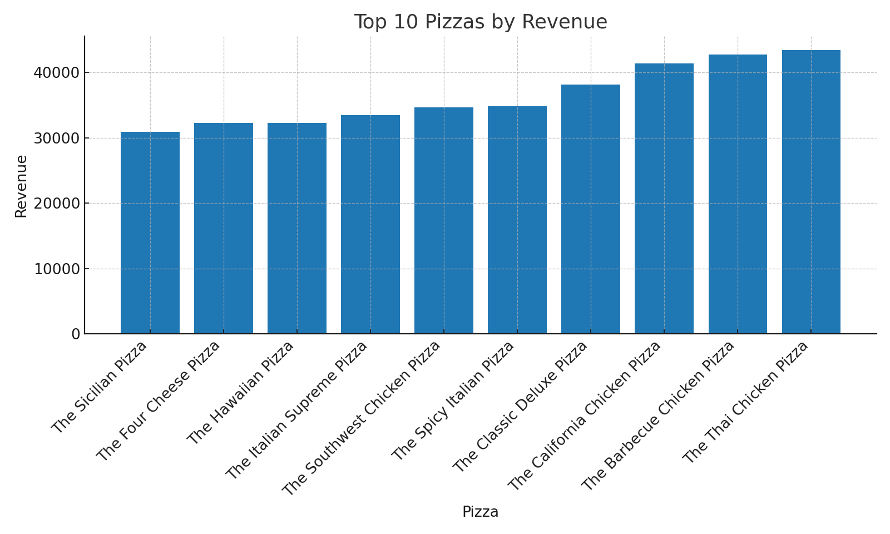
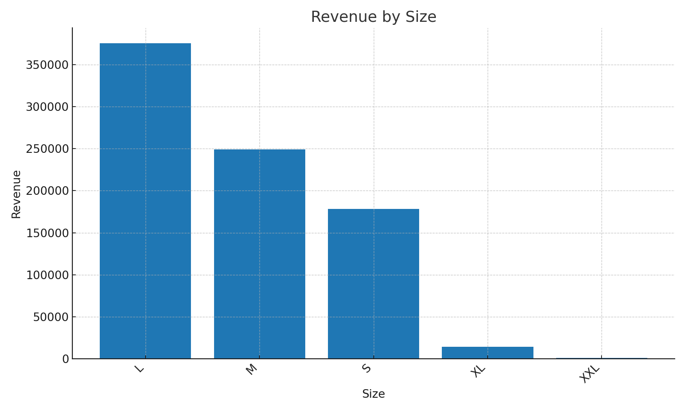
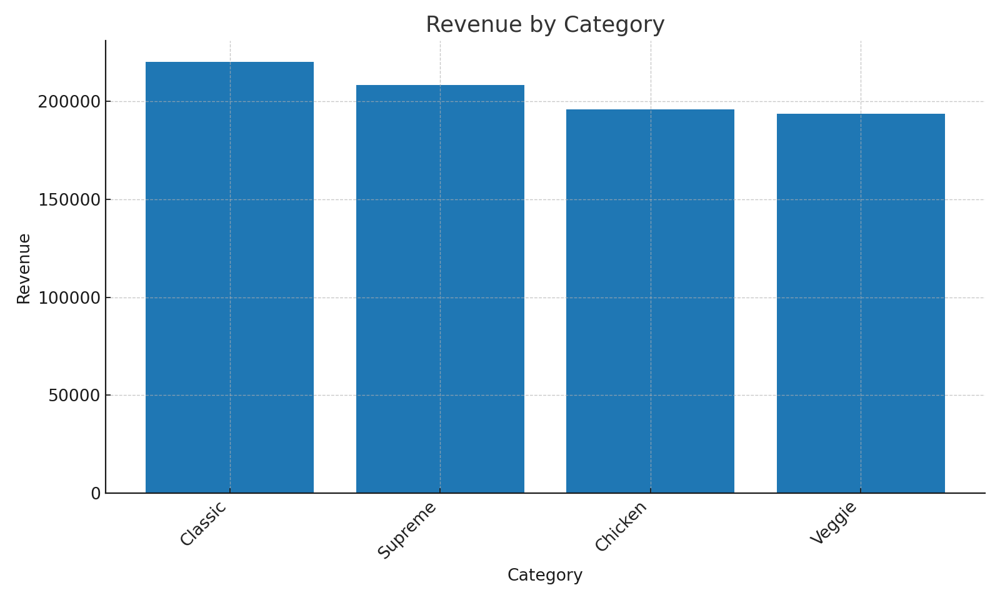

# 🍕 Pizza Sales Power BI Dashboard (Human-Friendly)

This repo contains a complete, **human-friendly** Power BI dashboard project for a Pizza Sales dataset. It includes:
- A ready-to-use dataset (`data/pizza_sales.csv`)
- A clear build guide for Power BI (with **copy‑paste DAX**)
- Suggested visuals and layout
- Exported insights and charts for README
- Images (from you) to use in the README or the report theme

> Note: I couldn't open your YouTube link from here, so I recreated a clean, professional dashboard spec based on common Pizza BI patterns and your dataset. You can still follow along easily and make it your own.

---

## 🔧 What You'll Build

A clean, single‑page Power BI report with:
- **KPIs**: Total Revenue, Total Orders, Total Pizzas Sold, AOV, Avg Pizzas/Order
- **Trends**: Monthly revenue line
- **When to sell**: Revenue by Weekday and by Hour
- **What sells**: Top 10 Pizzas by Revenue
- **Segments**: Revenue by Category and by Size
- **Slicers**: Date, Category, Size

---

## 🗂️ Repo Structure

```
pizza_sales_github_project/
├─ data/
│  └─ pizza_sales.csv
├─ images/        # your provided images
├─ outputs/       # auto-generated charts from the dataset
│  ├─ monthly_revenue.png
│  ├─ weekday_revenue.png
│  ├─ top10_pizzas.png
│  ├─ revenue_by_size.png
│  └─ revenue_by_category.png
├─ docs/
├─ LICENSE
└─ .gitignore
```

---

## 📊 Quick Insights (from the CSV)

- **Total Revenue**: 817,860.05
- **Total Orders**: 21,350
- **Total Pizzas Sold**: 49,574
- **Average Order Value (AOV)**: 38.31
- **Avg Pizzas per Order**: 2.32

### Sample Charts






> If any chart is missing above, it means your CSV didn’t include that column (e.g., Size/Category). The Power BI build still works—just omit that visual or map it to available fields.

---

## 🖥️ Build in Power BI – Step by Step

1. **Create a new Power BI file** (`File > New`).  
2. **Get Data** → CSV → select `data/pizza_sales.csv`. Load as table **Pizza**.
3. **Check column types** (Model view). Make sure:
   - `Order Date` is **Date**
   - `Order Time` is **Time** (or keep as text if not available)
   - `Quantity` is **Whole Number**
   - `Unit Price` and `Total Price` are **Decimal Number**
4. **Create a Date table** (Modeling → New Table) and paste:
   ```DAX
-- Create a Date table (Power BI Modeling > New Table)
Date =
ADDCOLUMNS (
    CALENDAR ( MIN ( 'Pizza'[Order Date] ), MAX ( 'Pizza'[Order Date] ) ),
    "Year", YEAR ( [Date] ),
    "Month Number", MONTH ( [Date] ),
    "Month", FORMAT ( [Date], "MMM" ),
    "Year-Month", FORMAT ( [Date], "YYYY-MM" ),
    "Weekday", FORMAT ( [Date], "dddd" )
)

-- Mark Date[Date] as Date Table (Modeling > Mark as date table)

-- Core Measures (Modeling > New measure)
Total Revenue = SUM ( 'Pizza'[Total Price] )

Total Orders = DISTINCTCOUNT ( 'Pizza'[Order ID] )

Total Pizzas Sold = SUM ( 'Pizza'[Quantity] )

   ```
   Then **Mark as date table** on `Date[Date]`.
5. **Create Relationships** (Model view):
   - `Pizza[Order Date]` → `Date[Date]` (**Many-to-One**, Single, Direction: Single)
6. **Create Measures** (Modeling → New measure) and paste:
   ```DAX
Total Revenue = SUM ( 'Pizza'[Total Price] )

Total Orders = DISTINCTCOUNT ( 'Pizza'[Order ID] )

Total Pizzas Sold = SUM ( 'Pizza'[Quantity] )

Average Order Value (AOV) =
DIVIDE ( [Total Revenue], [Total Orders] )

Average Pizzas per Order =
DIVIDE ( [Total Pizzas Sold], [Total Orders] )

-- Trend Measures
Revenue MTD =
TOTALMTD ( [Total Revenue], 'Date'[Date] )

Revenue YTD =
TOTALYTD ( [Total Revenue], 'Date'[Date] )

-- Category/Size Shares
Revenue by Category = [Total Revenue]
Revenue by Size = [Total Revenue]
   ```
7. **Build the layout** (Report view):
   - **Top KPIs**: Card visuals for `[Total Revenue]`, `[Total Orders]`, `[Total Pizzas Sold]`, `[Average Order Value (AOV)]`, `[Average Pizzas per Order]`
   - **Monthly Trend**: Line chart — Axis: `Date[Year-Month]`, Values: `[Total Revenue]`
   - **Revenue by Weekday**: Column chart — Axis: `Date[Weekday]`, Values: `[Total Revenue]`
   - **Top 10 Pizzas**: Bar chart — Axis: `Pizza[Pizza Name]`, Values: `[Total Revenue]`; use Top N filter (Top 10 by `[Total Revenue]`)
   - **Revenue by Category**: Donut/column — `Pizza[Category]` vs `[Total Revenue]`
   - **Revenue by Size**: Column — `Pizza[Size]` vs `[Total Revenue]`
   - **Slicers**: `Date[Year]`, `Pizza[Category]`, `Pizza[Size]`
8. **Formatting (human-friendly)**:
   - Use short labels, thousand separators, and Rs/$ currency (Modeling → Format)
   - Sort weekday axis Monday→Sunday
   - Set page background to a very light gray; use clean fonts
9. **Save** your report as `Pizza-Sales-Dashboard.pbix` at the repo root.

> **Tip:** If your column names differ (e.g., `item_name` instead of `Pizza Name`), just map visuals and DAX to your actual names. The idea stays the same.

---

## 🧮 DAX – Copy/Paste

```DAX
-- Create a Date table (Power BI Modeling > New Table)
Date =
ADDCOLUMNS (
    CALENDAR ( MIN ( 'Pizza'[Order Date] ), MAX ( 'Pizza'[Order Date] ) ),
    "Year", YEAR ( [Date] ),
    "Month Number", MONTH ( [Date] ),
    "Month", FORMAT ( [Date], "MMM" ),
    "Year-Month", FORMAT ( [Date], "YYYY-MM" ),
    "Weekday", FORMAT ( [Date], "dddd" )
)

-- Mark Date[Date] as Date Table (Modeling > Mark as date table)

-- Core Measures (Modeling > New measure)
Total Revenue = SUM ( 'Pizza'[Total Price] )

Total Orders = DISTINCTCOUNT ( 'Pizza'[Order ID] )

Total Pizzas Sold = SUM ( 'Pizza'[Quantity] )

Average Order Value (AOV) =
DIVIDE ( [Total Revenue], [Total Orders] )

Average Pizzas per Order =
DIVIDE ( [Total Pizzas Sold], [Total Orders] )

-- Trend Measures
Revenue MTD =
TOTALMTD ( [Total Revenue], 'Date'[Date] )

Revenue YTD =
TOTALYTD ( [Total Revenue], 'Date'[Date] )

-- Category/Size Shares
Revenue by Category = [Total Revenue]
Revenue by Size = [Total Revenue]
```

> Rename `'Pizza'` and column names to match yours (exact spelling).

---

## 📁 Add to GitHub

1. Create a new repo named `pizza-sales-powerbi`.
2. Add files/folders from this project. Suggested commit message:
   - `chore: add dataset, README, charts, license`
3. (Optional) Add your `Pizza-Sales-Dashboard.pbix` to the repo root.
4. Add screenshots of your report to `docs/` and reference them in the README.

---

## 🧑‍🤝‍🧑 Contribution

PRs are welcome! Please:
- Add context to your changes
- Include before/after screenshots
- Keep visuals accessible (labels, alt text)

---

## 📜 License

This project is released under the **MIT License** (see `LICENSE`).

---

## ✅ Conclusion

This project gives you a clean, **human-friendly** starting point for your Pizza BI dashboard. You can ship it as-is or build further with RLS, What‑If parameters, or a dataflow.

Happy building! 🍕🚀
